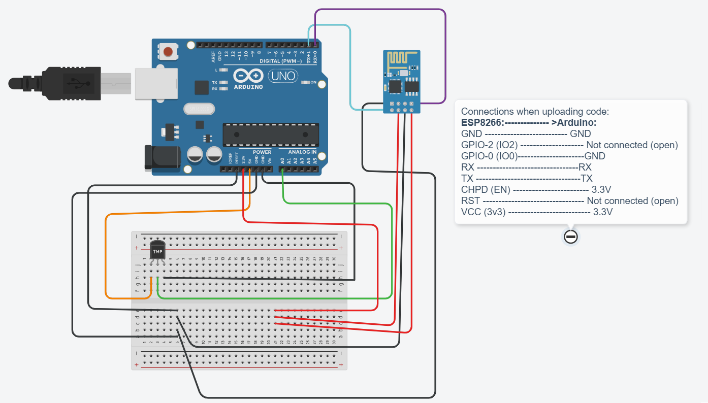
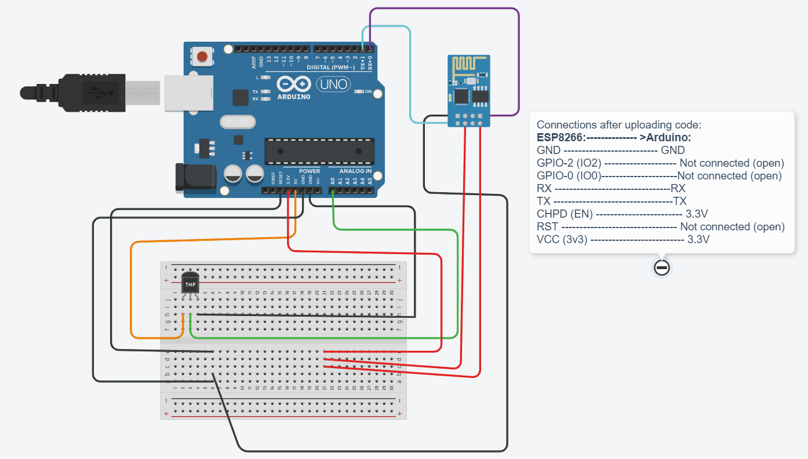

# Arduino Code for Covid Detector

## Components:

- Arduino Uno R3
- Wifi Module (ESP8266)
- Temperature Sensor (TMP36)
- Breadboard
- Jumper Wires

## Arduino circuit

### When uploading the code

### When running (done uploading code)

